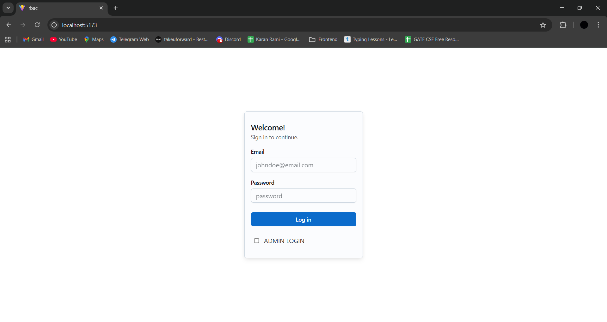

## RBAC Admin Panel (React + Vite)

Modern, production-ready admin panel demonstrating role-based access control (RBAC) with fine-grained permissions. Built with React, Vite, Zustand, React Query, Material UI, and Tailwind (via PostCSS).

### Highlights
- **Authentication & Session**: Email/password login, JWT persisted in `localStorage`.
- **RBAC Enforcement**: Route-level and component-level guards; permission-aware UI actions.
- **CRUD Dashboards**: Users, Categories, Products (with images), and Orders (status updates).
- **React Query**: Declarative data fetching, caching, optimistic updates.
- **Clean API Layer**: Axios instance with base URL; easy to add interceptors.

## Features
- **Login**: Standard and admin login flows.
- **Admin Panel**: Drawer navigation with permission-gated modules.
- **Users**: List, edit, and delete users (permissions required).
- **Categories**: List, add, edit, delete with modal forms.
- **Products**: List, add/edit (multipart image upload), delete.
- **Orders**: List, view details, update status with inline controls.
- **RBAC Matrix**: Visual UI to assign roles and grant permissions.

## Tech Stack
- **Frontend**: React 18, Vite, React Router
- **State**: Zustand (auth store)
- **Data**: @tanstack/react-query
- **UI**: MUI (Joy + Material), Tailwind CSS utilities
- **HTTP**: Axios (shared instance in `src/api/api.js`)

## Architecture
- `src/Store/auth.store.js`: Central auth state (token, user, permissions) with helpers like `hasPermission`.
- `src/components/AccessControl.jsx`: Wrapper to show/hide UI based on required permissions.
- `src/components/ProtectedRoute.jsx`: Route guard that redirects unauthenticated/unauthorized users.
- `src/services/auth.service.js`: Login flows using the shared API instance.
- `src/pages/*`: Feature dashboards for Users, Categories, Products, Orders, and RBAC.
- `src/api/api.js`: Axios instance (`baseURL` = `http://localhost:3000/api/v1`).

## RBAC Model
- A user’s `permissions` array is persisted post-login.
- `hasPermission(requiredPerms: string[])` returns true if the user has at least one of the required permissions.
- UI elements (buttons/sections) and navigation links are wrapped by `AccessControl`.
- Routes can be gated via `ProtectedRoute` with `requiredPerms`.

## Getting Started

### Prerequisites
- Node.js 18+ and npm
- Backend API available at `http://localhost:3000/api/v1`

### Install & Run
```bash
npm install
npm run dev
```

The app starts on `http://localhost:5173` (default Vite port).

### Build & Preview
```bash
npm run build
npm run preview
```

## Environment & Configuration
- API base URL is defined in `src/api/api.js`:
  - Update `baseURL` if your backend runs on a different host/port.
- Auth token is stored in `localStorage` under `token`; `user` and `permissions` are also persisted.
- If your backend expects `Bearer <token>`, add an Axios request interceptor to prepend the scheme.

## Available Scripts
- `npm run dev`: Start development server with HMR.
- `npm run build`: Production build.
- `npm run preview`: Preview the production build locally.
- `npm run lint`: Lint the project (if configured in `eslint.config.js`).

## Project Structure
```
src/
  api/
    api.js               # Axios instance
  components/
    AccessControl.jsx    # Permission-based UI guard
    ProtectedRoute.jsx   # Route guard
    ProductModal.jsx     # Product add/edit modal
  pages/
    Login.jsx
    AdminPanel.jsx
    Users.jsx
    Categories.jsx
    Products.jsx
    Orders.jsx
    RBAC.jsx
  services/
    auth.service.js      # Login services
  Store/
    auth.store.js        # Zustand auth store
  main.jsx, App.jsx, index.css
```

## Screenshots (Placeholders)
> Replace with actual screenshots from your environment.

| Login | Admin Panel | RBAC |
|---|---|---|
|  |  |  |

## Notes & Future Improvements
- Normalize permission naming across sidebar and pages (e.g., `read/write/update/delete-<module>-management`).
- Centralize auth header via Axios interceptor; handle 401 with store `logout`.
- Add `/unauthorized` route for clearer UX on permission denial.
- Strengthen RBAC matrix to avoid duplicate role/permission creation.

## License
This project is for educational/demo purposes. Add your preferred license here.
